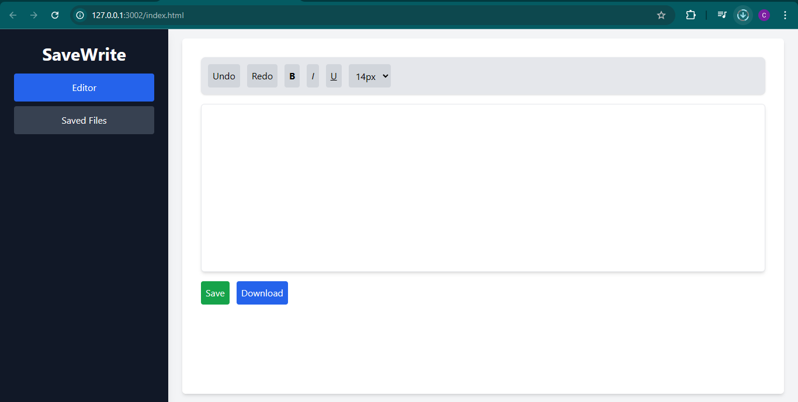
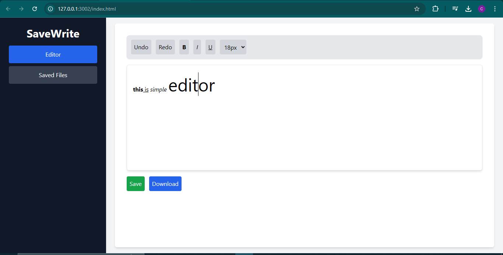
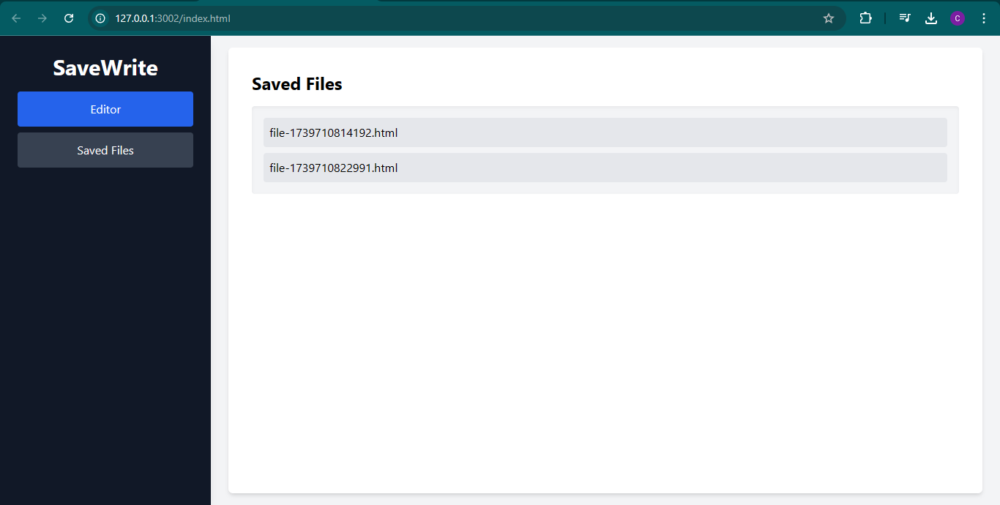

# 📝 SaveWrite - Web-Based Text Editor  

SaveWrite is a simple and efficient web-based text editor with basic text formatting, undo/redo functionality, and the ability to save and download files. Built with **HTML, Tailwind CSS, and JavaScript**, it provides a clean and intuitive user experience.

---

## 🚀 Features  
✔️ **Rich Text Editing** - Supports bold, italic, and underline.  
✔️ **Undo & Redo** - Track and revert changes easily.  
✔️ **Font Size Selection** - Customize text size.  
✔️ **File Management** - Save and open files from the app.  
✔️ **Download Files** - Export content as an HTML file.  

---

## 📸 Screenshots  

### 🏠 Home UI  
  

### ✍️ Editor Page  
  

### 📁 Saved Files View  
  

---
🎨 Tech Stack

Frontend: HTML, Tailwind CSS, JavaScript

## 🛠️ Installation & Usage  

1️⃣ **Clone the Repository**  
```sh
git clone https://github.com/CRSANNUTH/SaveWrite.git
cd SaveWrite
start index.html


